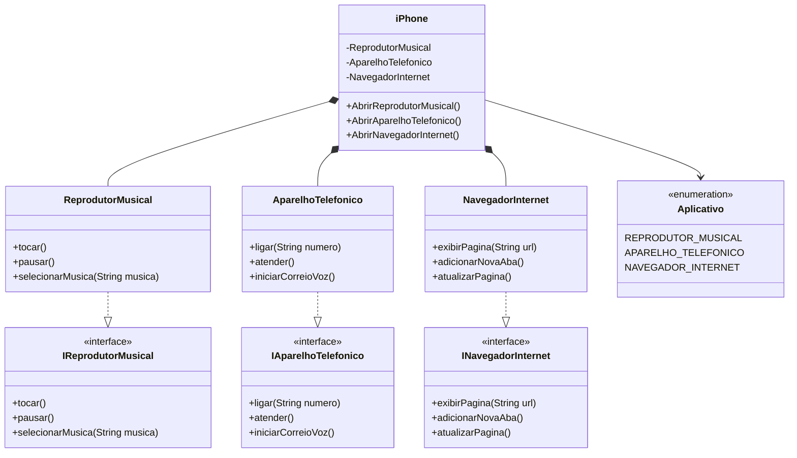

```mermaid
classDiagram

    iPhone *-- ReprodutorMusical
    iPhone *-- AparelhoTelefonico
    iPhone *-- NavegadorInternet
    iPhone --> Aplicativo

    ReprodutorMusical ..|> IReprodutorMusical
    AparelhoTelefonico ..|> IAparelhoTelefonico
    NavegadorInternet ..|> INavegadorInternet

    class IReprodutorMusical {
    <<interface>> 
        +tocar()
        +pausar()
        +selecionarMusica(String musica)
    }

    class IAparelhoTelefonico {
    <<interface>> 
        +ligar(String numero)
        +atender()
        +iniciarCorreioVoz()
    }

    class INavegadorInternet {
    <<interface>> 
        +exibirPagina(String url)
        +adicionarNovaAba()
        +atualizarPagina()
    }

    class ReprodutorMusical {
        +tocar()
        +pausar()
        +selecionarMusica(String musica)
    }

    class AparelhoTelefonico {
        +ligar(String numero)
        +atender()
        +iniciarCorreioVoz()
    }

    class NavegadorInternet {
        +exibirPagina(String url)
        +adicionarNovaAba()
        +atualizarPagina()
    }

    class iPhone {
        -ReprodutorMusical
        -AparelhoTelefonico
        -NavegadorInternet

      +AbrirReprodutorMusical()
      +AbrirAparelhoTelefonico()
      +AbrirNavegadorInternet()
    }

    class Aplicativo {
    <<enumeration>>
    REPRODUTOR_MUSICAL
    APARELHO_TELEFONICO
    NAVEGADOR_INTERNET
    }

```